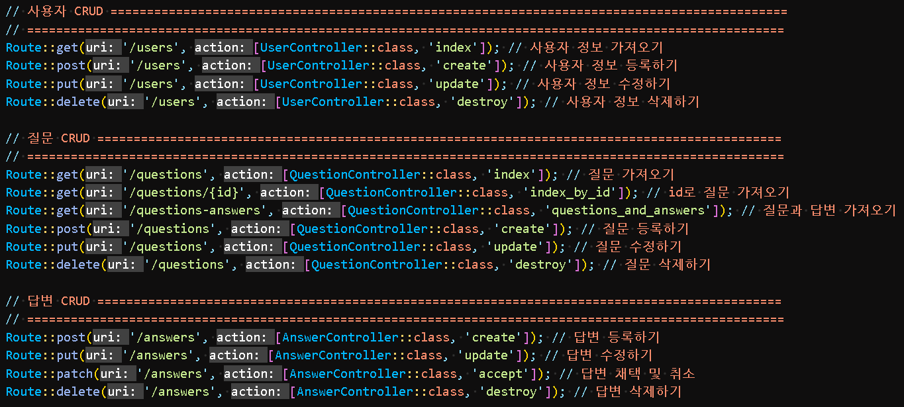

## 코멘토 Backend 과제 (작업지시서)

| 목차                                   |                                              |
| -------------------------------------- | -------------------------------------------- |
| [1. 작성자](#작성자)                   | [2. 작성 기한](#작성-기한)                   |
| [3. 기획자의 메시지](#기획자의-메시지) | [4. 개발 팀장의 메시지](#개발-팀장의-메시지) |
| [5. 기획](#기획)                       | [6. Data](#Data)                             |
| [7. API](#API)                         |                                              |

### 작성자

<pre>
조상호

hyundai_sangho@naver.com
</pre>

### 작성 기한

<pre>
2023년 5월 23일(화) 오후 2시 ~ 2023년 5월 28일(일) 자정(밤 12시)
</pre>

### 기획자의 메시지

```
안녕하세요, 개발자님.
이번 서비스의 기획을 맡은 기획자입니다.

저희는 '고양이 온라인 익명 멘토링 서비스'를 개발하려고 합니다.
아래 예시는 **현재 생각하는 가장 기본 정보 이며 데이터는 계속 추가될 수도 있습니다.
이 부분을 염두에 두시고 데이터베이스 설계, API 제작을 요청드립니다.

추가로 개발자님 생각에 더 필요해 보이는 기능이 있다면 자유롭게 만들어 주셔도 무관합니다. :)

작업 기간은 5일 입니다.
5일 안에 모든 기능을 구현할 필요는 없고 작업하실 수 있는 만큼 작업해 주세요.
그 이후 개발은 다른 팀 개발자분이 진행하게 될 예정입니다.

문의사항이 있다면 언제든 연락주세요.

감사합니다.
코멘토 기획자 드림.
```

### 개발 팀장의 메시지

```
안녕하세요 개발자님.
개발 팀장입니다.

이번에 신규 서비스 초기 개발을 맡았다고 들었습니다.
부담스러울 수도 있을 텐데 좋은 기회라 생각합니다. 잘 해주시길 부탁드립니다.

다음 주부터는 다른 팀 개발자도 투입이 되고 빠르게 검증을 해야 할 것 같아서
개발 스택은 Laravel 프레임워크로 부탁드리겠습니다.
그리고 MVP 모델이다 보니 최대한 유연하게 작성하시면 좋을 것 같습니다.

감사합니다.
개발 팀장 드림.
```

## 기획

### 고양이 온라인 익명 멘토링 서비스 (코멘토 고양이 버전)

고양이 멘토가 멘티들에게 익명 멘토링을 해주는 서비스를 제작하려고 합니다.

**질문 (예시)**

-   제목: 집사에 대한 질문입니다.
-   내용: 제가 먼치킨 고양이인데 집사가 다리짧다고 놀리는데 냥냥펀치 날려야 할까요?
-   질문 타입: 집사후기

**답변 (예시)**

-   내용: 츄르주면 용서하는데 안 줬다면 날려도 무죄입니다.
-   채택 여부: Y/N

**유저(고양이) 정보 (예시)**

-   품종: 먼치킨
-   나이: 10살
-   털 색깔/무늬: 삼색
-   유저 형태: 멘토

## Data

-   **질문 타입 종류**

    -   사료
    -   그루밍
    -   집사 후기

-   **유저(고양이) 정보 - 품종 종류**

    -   터키쉬 앙고라
    -   샴
    -   스코티쉬 폴드
    -   러시안 블루
    -   먼치킨
    -   코리안 숏헤어
    -   스노우슈

-   **유저(고양이) 정보 - 나이 종류 (민감한 정보입니다.)**

    -   1살 ~ 15살

-   **유저(고양이) 정보 - 털 색깔/무늬 종류**

    -   흰색
    -   회색
    -   검정색
    -   삼색
    -   턱시도
    -   고등어
    -   치즈

-   **유저(고양이) 정보 - 유저 형태 종류**
    -   멘토
    -   멘티

## API



1. 유저(고양이) 정보 받아오기 - 비회원 조회 불가

| Index | Method | URI                             | 기능                       |
| :---: | :----: | :------------------------------ | :------------------------- |
|   1   |  GET   | http://127.0.0.1:8000/api/users | 유저(고양이) 정보 받아오기 |

<pre>

• [HEADERS]
  Authorization: Basic Username:Password

• Response
  {
    "품종": "코리안숏헤어",
    "나이": 9,
    "털색깔/무늬": "턱시도",
    "유저형태": "멘티"
  }
</pre>

2. 질문 가져오기 - 비회원 조회 가능

| Index | Method | URI                                          | 기능          |
| :---: | :----: | :------------------------------------------- | :------------ |
|   2   |  GET   | http://127.0.0.1:8000/api/users?pageNumber=1 | 질문 가져오기 |

<pre>

• Response
  {
    "제목": "집사에 대한 질문입니다.",
    "내용": "제가 먼치킨 고양이인데 집사가 다리 짧다고 놀리는데 냥냥펀치 날려야 할까요?",
    "작성날짜": "2023-05-28 22:10:11",
    "유저정보": {
      "품종": "러시안 블루",
      "털색깔/무늬": "검정색",
      "유저형태": "멘티"
    }
  },
</pre>

3. id로 질문 가져오기

| Index | Method | URI                                      | 기능               |
| :---: | :----: | :--------------------------------------- | :----------------- |
|   3   |  GET   | http://127.0.0.1:8000/api/questions/{id} | id로 질문 가져오기 |

<pre>

• Response
  {
    "제목": "집사에 대한 질문입니다.",
    "내용": "제가 먼치킨 고양이인데 집사가 다리 짧다고 놀리는데 냥냥펀치 날려야 할까요?",
    "작성날짜": "2023-05-28 22:10:11",
    "유저정보": {
      "품종": "러시안 블루",
      "털색깔/무늬": "검정색",
      "유저형태": "멘티"
    }
  },
</pre>

4. 질문과 답변 가져오기 - 비회원 조회 가능

| Index | Method | URI                                         | 기능                 |
| :---: | :----: | :------------------------------------------ | :------------------- |
|   4   |  GET   | http://127.0.0.1:8000/api/questions-answers | 질문과 답변 가져오기 |

<pre>

• Response
[
    {
        "제목": "집사에 대한 질문입니다.",
        "내용": "제가 먼치킨 고양이인데 집사가 다리 짧다고 놀리는데 냥냥펀치 날려야 할까요?",
        "작성날짜": "2023-05-31",
        "유저정보": {
            "품종": "터키쉬앙고라",
            "털색깔/무늬": "흰색",
            "유저형태": "멘토"
        },
        "답변리스트": [
            {
                "답변내용": "츄르주면 용서하는데 안 줬다면 날려도 무죄입니다.",
                "답변채택여부": "no",
                "답변날짜": "2023-05-31 23:25:38",
                "답변자유저정보": {
                    "품종": "터키쉬앙고라",
                    "털색깔/무늬": "흰색",
                    "유저형태": "멘토"
                }
            }
        ]
    }
]
</pre>

5. 질문 등록
   질문은 제목, 내용, 질문 타입이 꼭 입력되어야 합니다.

| Index | Method | URI                                 | 기능      |
| :---: | :----: | :---------------------------------- | :-------- |
|   5   |  POST  | http://127.0.0.1:8000/api/questions | 질문 등록 |

<pre>
• Request
  {
    "user_uniqueid": "647608f3e14dc",
    "title": "집사에 대한 질문입니다.",
    "content": "제가 먼치킨 고양이인데 집사가 다리 짧다고 놀리는데 냥냥펀치 날려야 할까요?"
    "type": "집사후기"
  }

• Response
  [성공]
  {
    "message": "질문이 등록되었습니다."
  }

  [실패]
  {
    "message": "질문이 등록되지 않았습니다."
  }
</pre>

6.  질문 삭제
    -   질문에 답변이 달린 이후에는 삭제가 불가합니다.
7.  질문 수정
    -   질문에 답변이 달린 이후에는 수정이 불가합니다.
8.  답변 작성
    답변이 3개 이상 달린 경우 작성이 불가합니다.

| Index | Method | URI                               | 기능      |
| :---: | :----: | :-------------------------------- | :-------- |
|   8   |  POST  | http://127.0.0.1:8000/api/answers | 답변 작성 |

<pre>
• Request
  {
    "question_id": "2",
    "user_uniqueid": "647608f3e14dc",
    "content": "츄르주면 용서하는데 안 줬다면 날려도 무죄입니다."
    "questions_uniqueid": "647756a89c15f"
  }

• Response
  [성공]
  {
    "message": "답변이 등록되었습니다."
  }

  [실패]
  {
    "message": "답변이 등록되지 않았습니다."
  }
</pre>

9.  답변 수정
    -   해당 답변이 채택된 이후엔 수정이 불가합니다.
10. 답변 삭제

    -   해당 답변이 채택된 이후엔 삭제가 불가합니다.

11. 회원 가입

| Index | Method | URI                             | 기능      |
| :---: | :----: | :------------------------------ | :-------- |
|  10   |  POST  | http://127.0.0.1:8000/api/users | 회원 가입 |

<pre>
• Request
  {
    "name": "chosangho",
    "email": "chosangho@naver.com",
    "password": "!chosangho123",
    "kind": "터키쉬앙고라",
    "age": "3",
    "haircolor_pattern": "흰색",
    "type": "멘토"
  }

• Response
  [성공]
  {
    "message": "회원 가입이 되었습니다."
  }

  [실패]
  {
    "message": "회원 가입이 되지 않았습니다."
  }
</pre>

12 사용자 조회하기

| Index | Method | URI                             | 기능            |
| :---: | :----: | :------------------------------ | :-------------- |
|  10   |  GET   | http://127.0.0.1:8000/api/users | 사용자 조회하기 |

<pre>
• [HEADERS]
  Authorization: Basic Username:Password

• Response
  {
    "품종": "터키쉬앙고라",
    "나이": 3,
    "털색깔/무늬": "흰색",
    "유저형태": "멘토"
  }
</pre>

13. 사용자 수정하기

| Index | Method | URI                             | 기능            |
| :---: | :----: | :------------------------------ | :-------------- |
|  12   |  PUT   | http://127.0.0.1:8000/api/users | 사용자 수정하기 |

<pre>
• Request
  {
    "unique_id": "6475ff1a0a15a",
    "name": "chosangho",
    "email": "chosangho@naver.com",
    "password": "!chosangho123",
    "kind": "터키쉬앙고라",
    "age": "3",
    "haircolor_pattern": "흰색",
    "type": "멘토"
  }

• Response
  [성공]
  {
    "업데이트 되었습니다."
  }

  [실패]
  {
    "업데이트 되지 않았습니다."
  }
</pre>

14. 사용자 삭제하기

| Index | Method | URI                             | 기능            |
| :---: | :----: | :------------------------------ | :-------------- |
|  13   | DELETE | http://127.0.0.1:8000/api/users | 사용자 조회하기 |

<pre>
• Request
  {
    "unique_id": "6475ff1a0a15a"
  }

• Response
  [성공]
  {
    "삭제되었습니다."
  }

  [실패]
  {
    "존재하지 않는 unique_id 입니다."
  }
</pre>

## 배운 점

1. 라라벨 공부 필요함.(추상화된 작업들이 많기 때문에 프레임워크에 대한 이해도가 높아야 자유자재로 사용이 가능함)
2. SQL 공부 필요함.(여러 데이터를 조합하고 추출함에 있어서 쿼리를 잘 알아야 할 필요성 있음)

## 수정 요망

1. 사용자 정보 등록시 이름, 이메일, 비번 등의 유효성 검사 처리
2. 주석 처리
3. 디비 재설계
4. 테스트 코드 작성
5. 상황에 맞는 에러 코드 작성하기 400, 401, 404 등등..

<!-- ## 과제 순서

1. 라라벨 프로젝트 만들기

2. API 만들기

3. POSTMAN 작동 움짤 GIF 만들기, 유튜브 영상 만들기

4. 깃헙 프라이빗 레포 개설 후 콜라보레이터로 comentDev 추가

5. 지원 동기, 깃헙 URL 메일로 전송(담당자: jaehyeong.choi@comento.kr) -->

<!-- ## API

1. 유저(고양이) 정보 받아오기 - 비회원 조회 불가

| Index | Method | URI                            | 기능                       |
| :---: | :----: | :----------------------------- | :------------------------- |
|   1   |  GET   | http://127.0.0.1:8000/api/cats | 유저(고양이) 정보 받아오기 |

<pre>
• Request (Body)
  {
    "userUniqueId": "1239420042",
  }

• Response
  {
    품종 : "러시안 블루",
    나이 : "2",
    털색깔/무늬: "회색",
    유저형태: "멘토"
  }
</pre>

2. 질문 가져오기 - 비회원 조회 가능

| Index | Method | End Point               | 기능          |
| :---: | :----: | :---------------------- | :------------ |
|   2   |  GET   | /cats?question=y&page=1 | 질문 가져오기 |

<pre>
• Response
  {
    제목 : "집사에 대한 질문입니다.",
    내용 : "제가 먼치킨 고양이인데 집사가 다리짧다고 놀리는데 냥냥펀치 날려야 할까요?",
    작성날짜: "2023-05-28",
    유저정보: {"품종" => "먼치킨", "털색깔/무늬"=> "회색", "유저형태"=> "멘토"}
  }
</pre>

3. 질문과 답변 가져오기 - 비회원 조회 가능

| Index | Method | End Point                        | 기능                 |
| :---: | :----: | :------------------------------- | :------------------- |
|   3   |  GET   | /cats?question=y&answer=y&page=1 | 질문과 답변 가져오기 |

<pre>
• Response
  {
    제목 : "집사에 대한 질문입니다.",
    내용 : "제가 먼치킨 고양이인데 집사가 다리짧다고 놀리는데 냥냥펀치 날려야 할까요?",
    작성날짜: "2023-05-28",
    유저정보: ["품종" => "먼치킨", "털색깔/무늬"=> "회색", "유저형태"=> "멘토"]
    답변리스트: {
        "답변내용" => "츄르주면 용서하는데 안 줬다면 날려도 무죄입니다.",
        "답변채택여부" => "N",
        "답변날짜" => "2022-05-28",
        "답변자유저정보" => {"품종" => "먼치킨", "털색깔/무늬"=> "회색", "유저형태"=> "멘토"}
    }
  }
</pre>

4. 질문 등록

| Index | Method | End Point | 기능      |
| :---: | :----: | :-------- | :-------- |
|   4   |  POST  | /cats.php | 질문 등록 |

<pre>
• Request (Body)
  {
    "제목": "집사에 대한 질문입니다.",
    "내용": "제가 먼치킨 고양이인데 집사가 다리짧다고 놀리는데 냥냥펀치 날려야 할까요?",
    "질문타입": "집사후기"
  }
</pre>

5. 질문 삭제

    - 질문에 답변이 달린 이후에는 삭제가 불가합니다.

6. 질문 수정

    - 질문에 답변이 달린 이후에는 수정이 불가합니다.

7. 답변 작성

    - 답변이 3개 이상 달린 경우 작성이 불가합니다.

8. 답변 수정

    - 해당 답변이 채택된 이후엔 수정이 불가합니다.

9. 답변 삭제

    - 해당 답변이 채택된 이후엔 삭제가 불가합니다.
 -->
